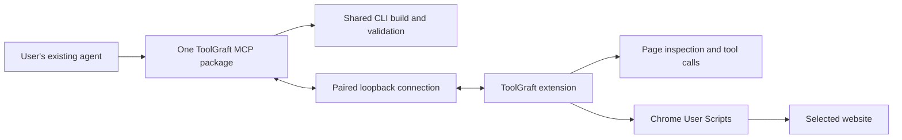

# Guided adapter creation and repair

Design contract, September 23, 2026. The local MCP, authoring tools, managed runtime,
installation review and on-demand tabs are implemented. See project-status.md for
verification. Cloud transport and registry contribution remain future work.

## Product constraint: bring your existing agent

ToolGraft provides no internal AI, model subscription, inference API, model-key
entry, or token billing. The user's external agent asks questions, interprets page
evidence, generates source and chooses repairs using its existing subscription or
model setup. ToolGraft supplies deterministic tools, instructions, diagnostics,
installation and verification. The companion must not call a model API or extract
the agent's login credentials. Existing agent usage limits and permissions apply;
MCP compatibility must be verified per client rather than promised for every plan.

An extension action hands a task to the connected agent, or provides a copyable
task when that agent has no supported handoff mechanism. It does not open a
ToolGraft-hosted AI chat. Transport/pairing credentials, if needed for a future
cloud connection, are distinct from model credentials and must be described as such.

## Product experience

The user opens a site and chooses **Create with your agent** in ToolGraft, or asks
their connected agent to create an adapter for a URL. The agent asks what operations
the user wants and what a successful result looks like. A domain alone is not a
sufficient tool specification. Login, navigation, and additional origins remain
visible steps if needed.

The agent inspects the chosen tab, proposes a small tool contract, creates source,
validates and builds the package, and sends it to the extension's installation
preview. The preview shows the requested tools, read/write behavior, exact hosts,
local/unreviewed status, source and version. The user approves installation and
any browser permission request. ToolGraft activates it on the selected page, the
agent discovers and calls its tools, and the UI reports the actual test result.
There is no manual source editing, archive download, or file picker in this flow.

Generated adapters can fail. A failed test returns diagnostics to the agent for a
bounded repair loop, not a fabricated success. Each changed executable candidate
needs a new digest and install approval. Authenticated reads can expose private
data to the model; the scope discussion must identify the selected account/tab.

The entry point for reasoning and generation is the user's existing agent.
The extension displays progress, requests browser permissions and presents
installation review. It does not offer an independent AI assistant.

## Open the right page on demand

Users should not need to prepare tabs. Native WebMCP and the current ToolGraft
runtime execute in a live page; the core MCP tools should manage that prerequisite.
Opening a tab is an ordinary step within an authorized site task, not a separate
permission question. Site-access grants, login, adapter installation and write
consent still retain their own boundaries.

Maintain a local catalog of installed adapters and their declared capabilities
even when no matching tab is open. Catalog entries are potential capabilities,
not proof of live tool registration. The agent can find a tool by operation/site,
then ask ToolGraft to ensure that its execution context is ready. This avoids
forcing the agent to search only the tabs the user happened to leave open.

1. Resolve an installed adapter, operation, intended account/profile and route.
   If no adapter exists, offer the authoring workflow rather than fabricating a
   callable tool. Only ask for account disambiguation when actually ambiguous.
2. Reuse a suitable authorized tab when possible. Otherwise open a ToolGraft-owned
   background tab for the intended route. Do not navigate away from unrelated
   user work. A tool may require a route more specific than the domain home page.
3. Wait for actual page/adapter readiness and discover its current tools. A tab's
   load-complete event alone does not prove that a SPA or adapter is ready.
4. Validate input and recheck adapter version, route, grants and session immediately
   before execution. Perform the requested operation and return its actual result.
5. Bring the tab forward when login, browser consent, a foreground-only interaction
   or the user's request requires it. Otherwise preserve the user's focus. Return
   a visible task/tab reference and a Show page action.

Proposed `toolgraft_call` should compose ensure-ready plus execution, so the agent
can request the operation without micromanaging tabs. Also expose ensure-ready for
inspection and authoring. Bind a returned context ID to profile, tab, document,
route, adapter version and account evidence where the adapter can provide it;
invalidate it after relevant navigation rather than executing against stale IDs.

Add validated launch-route metadata to the adapter contract where necessary.
Do not derive an executable URL from a wildcard match alone or follow URLs supplied
by page content as instructions. Generated routes must remain within authorized
origins. Native tools belonging to arbitrary sites can only be discovered after
opening those sites; an offline catalog can cover installed ToolGraft metadata,
not every unknown website's capabilities.

Handle frozen/discarded tabs and worker reconnects explicitly. Resume or reopen
eligible task tabs and rediscover tools before proceeding. Never silently replay
a write after navigation, timeout or lost response: report an uncertain outcome
and inspect state first. Deduplicate concurrent ensure-ready requests and keep
tab usage bounded. Track ownership; do not close user-owned tabs or tabs the user
has taken over. Defer automatic cleanup of created tabs until results and any
unsaved state have been handled.

Browser-open and browser-foreground are different requirements. Background reads
are a goal to prove per adapter, not a universal guarantee. This flow cannot run
page tools while the browser is closed or the computer is asleep. Always-on tasks
would need a separately running browser or a real server/API integration; the
current API adapters are also page-bound and do not solve that requirement.

## Architecture recommendation

Target setup: install the browser extension and add one ToolGraft MCP package to
the existing agent. No separate native helper installer, repository checkout,
standalone CLI installation, or mandatory skill is part of the normal user flow.
The MCP package includes the local bridge, build tools and documentation. A
Node-based distribution still requires Node in its execution environment; package
a suitable runtime or use the agent's supported package runner before claiming
zero additional runtime prerequisites. No package is published yet.

One local ToolGraft MCP entry should present site-tool discovery/execution and an
optional authoring session. Reuse the existing CLI/schema/SDK for construction.
Chrome DevTools MCP remains useful for development and acceptance, but should not
be a second user-configured server. The target normal-browser path needs packaged
extension inspection and execution operations without a user-managed debugging
port or a separately installed testing browser. Keep normal
site tools distinct from management operations; opening an arbitrary website must
not enable installation or give its content authority to start an authoring session.

The preferred local transport to prototype is a loopback WebSocket listener owned
by the MCP package, with an outbound connection from the extension. Pair the
selected browser/profile once using a short-lived bootstrap code, then retain a
revocable high-entropy connection credential. Bind only to loopback, check the
expected extension origin/host, and authenticate requests; origin checks alone
are not authentication. Do not embed a shared static secret or pass credentials
through page URLs. Multiple agents/processes and browser profiles need explicit
routing and collision handling. If a package-owned broker is needed, manage its
lifetime automatically rather than installing an independent background service.

Chrome documents service-worker WebSocket support, but ToolGraft must still prove
pairing, browser permission behavior, suspension/reconnect and package transport
on the supported browsers. This replaces the earlier separate Native Messaging
installer recommendation. Native Messaging is not required by this design.

First prove the user journey in the existing dedicated developer browser using
an extension-owned authoring page driven by the existing browser automation. That
prototype can reuse package staging before implementing the packaged transport.
It is a developer proof, not a claim that regular Chrome setup is finished.

The handoff and AGENTS.md deliberately excluded a custom MCP/native bridge from
v0.1. This proposal is the next milestone prompted by the guided-authoring request;
it does not silently redefine the completed preview. Preserve the original handoff
and record the scope change when implementation begins.

## Core tools available without a site adapter

The user's chosen interface is a core ToolGraft tool set, available through the
one MCP connection even when the browser has no adapters. Instructions are a
callable tool result, not a prerequisite skill installation. "Global" means
independent of the active website; it does not grant every website management
access. These tools belong to ToolGraft's paired management connection and must
not be registered into arbitrary pages as WebMCP tools. Reserve their namespace
so an installed adapter cannot replace an instruction or management tool.

The MCP exposes the protocol interface. The extension owns browser identity,
site grants, package revalidation, installation, activation and consent. Build
work stays in the MCP package. The browser extension does not need to become a
network-listening MCP server or run a model. Instructions and connection help can
be returned before pairing; browser operations require the selected connection.

## Proposed MCP operations

Names below are a proposed contract, not currently callable tools.

| Operation                    | Behavior                                                                                                        |
| ---------------------------- | --------------------------------------------------------------------------------------------------------------- |
| `toolgraft_get_instructions` | Return the versioned create/repair/use guide, schemas, examples and actually supported operations               |
| `toolgraft_status`           | Report connection/profile, supported capabilities, installed adapters and next setup action                     |
| `toolgraft_find_tools`       | Search installed capability metadata, including adapters whose pages are closed                                 |
| `toolgraft_ensure_page`      | Reuse or open the selected site's page and return a ready execution context or actionable blocked state         |
| `toolgraft_call`             | Ensure the page is ready, rediscover/revalidate, and execute an installed adapter tool                          |
| `toolgraft_begin_authoring`  | Bind the requested operations and selected tab to an authoring session                                          |
| `toolgraft_inspect`          | Obtain targeted page structure and behavior within that session                                                 |
| `toolgraft_scaffold`         | Create a draft using shared templates and SDK                                                                   |
| `toolgraft_patch`            | Apply draft source changes with a revision check                                                                |
| `toolgraft_validate`         | Run schema/build checks and requested behavior tests; return a candidate digest and separate diagnostic results |
| `toolgraft_request_install`  | Submit the candidate for extension revalidation and open its installation review; return a pending request ID   |
| `toolgraft_install_status`   | Report awaiting approval, declined, expired, installed or failed for that request, including version/hash       |
| `toolgraft_verify`           | Discover/call installed tools in the selected tab and report actual outcomes                                    |

`toolgraft_get_instructions` can accept a task such as create, repair or use and
return just the relevant guide. Its result should include a guide version,
protocol/adapter-schema version, supported operations and current limitations.
The expected loop is instructions → intent → inspect → scaffold/patch → validate
→ request install → install status → verify. Return pending operations promptly
so a user thinking about an install does not exhaust an MCP call timeout. No
install response may claim success before extension state confirms the exact
candidate hash. Validation is not a public-review or trustworthiness verdict.

Existing site-tool discovery/execution remains available through the same MCP
entry. A repair uses these same operations against a new draft of an installed
version. Avoid a second independent repair engine or package format. Expose a
short authoring guide through MCP so the agent knows to ask for intent before
inspection; do not rely on a client-specific skill as the only instruction source.

Serve a versioned quickstart through MCP initialization instructions and a help
tool, with resources/prompts as optional conveniences. Clients do not all expose
resources or prompts to their model, so the tool-only path must work. A help or
status response should state supported operations, connection state and the next
action. Generate a distributable skill and Markdown/llms.txt navigation from the
same maintained guide; do not maintain contradictory workflows per client.
The current portable draft is `skills/toolgraft-authoring/SKILL.md` and the
repository entry point is `llms.txt`. Neither implies an installed authoring MCP.

MCP location matters more than model brand. Hermes/OpenClaw on the browser's host
can use the proposed local transport. A VPS/container agent needs an explicitly
reachable browser connection, or an existing agent node on the browser host.
A localhost address in a VPS/container is not the user's laptop. A skill supplies
instructions, not network access. See `docs/agent-compatibility.md` for checked
client documentation and the difference between documented support and testing.

The companion owns fixed build commands and draft locations, not a general shell
endpoint for cloud callers. Refactor CLI operations into shared functions before
wrapping them. The current CLI imports compiled adapter definitions while
building; generated code must not gain access to the companion's credentials
through that step. Run definition extraction/tests in a confined build worker
with resource limits and no inherited secrets. Schema checks alone are not an
execution sandbox. A normal local coding agent may separately have broad shell
rights; the authoring interface does not change that fact.

## Extension changes

Current `stage-local` and `install` messages accept extension-owned senders only.
Keep that boundary. Factor staging/install into internal services shared by the
existing UI and the new companion handler, rather than allowing arbitrary websites
to send privileged install messages.

Bind every candidate to session, profile, intended adapter, version and digest.
Revalidate it in the extension, expire unused candidates, and consume approvals
once. Approval applies to the exact code and permissions displayed. A changed
candidate invalidates prior consent. Do not provide an MCP method that answers the
extension's consent prompt on the user's behalf.

Use `chrome.userScripts` for generated runtime code, preserving the existing
package/hash checks and optional host permissions. New host access requires a
browser-recognized user gesture. Already granted hosts still require the product's
candidate approval. Activation must handle the selected tab explicitly: existing
registration alone currently requires a reload. Warn if a reload would discard
unsaved work and allow the user to defer it.

Suggested states: intent needed, inspecting, building, awaiting install approval,
installed/unverified, testing, verified locally, failed. Keep installation separate
from verification. Failed candidates remain visibly unverified; cancellation and
repair must preserve a recoverable previous package and version.

## Repair and contribution

**Fix with your agent** supplies the failing tool, adapter version and sanitized
diagnostic. Reproduce the failure, change a draft, add a regression fixture, bump
the version, review the diff/permissions, install with consent and repeat the exact
failing operation. Never silently rewrite an installed immutable version.

Later, **Share adapter** can export source, manifest, license, synthetic tests and
verification metadata, and prepare a GitHub contribution to the adapter registry.
Public submission is a separate explicit action. No browser profile, session
tokens or private page fixtures belong in that contribution. GitHub identity is
needed for contribution, not local creation. Existing CI and registry immutability
checks can govern community fixes and version bumps. A local successful run is
not a public review badge.

## Acceptance before claiming this works

1. A real model asks for an operation on a site with no installed adapter and
   generates a working read tool from the actual page, without hand-editing its code.
2. The candidate reaches extension settings without a manual archive selection.
   Refusing consent leaves it uninstalled; granting consent installs the exact hash.
3. The model discovers the installed tool and returns verified page data. A build
   pass alone cannot satisfy this criterion.
4. Deliberately break page markup. The tool fails honestly; the model repairs it,
   adds a regression test and installs a newly approved version that fixes the call.
5. Test wrong profile/tab, stale revision, changed bytes after preview, expired
   session, missing site grants, signed-out state, and cancellation. Writes retain
   their separate execution approval.
6. On a clean supported browser, use only the extension and the MCP package.
   No repo, separate helper installation, manual build command or DevTools server
   may be required. Prove connection recovery and the workflow in Hermes and
   OpenClaw, with the optional skill absent as well as present.
7. Start with every target-site tab closed. Ask the agent for an installed read
   operation and prove it opens the right route in the background, waits for actual
   registration and returns correct data without a manual tab step. Then prove
   reuse, login-needed handling, wrong-account ambiguity, discarded-tab recovery,
   concurrent calls and prevention of uncertain write retries. Verify that user
   tabs and focus are preserved unless interaction is required.

The managed runtime now passes creation, execution and repair with native WebMCP
flags disabled. The MCP archive also starts via npx from an isolated directory
with an empty npm cache. These establish the local package path, not all of
criterion 6: Hermes/OpenClaw application runs and broader lifecycle/account cases
remain unverified. The model proof starts with a specified operation, so asking
for missing intent is instructed but not yet behaviorally tested. The model
repairs source; the harness supplies the retained synthetic regression scenario.

Start on the deterministic playground, then repeat creation on a previously
unsupported public site. Authenticated mail and cloud-agent transports are later
acceptance cases, not prerequisites for proving this core creation loop.

## Chrome references

- [Service-worker WebSockets](https://developer.chrome.com/docs/extensions/how-to/web-platform/websockets)
- [Optional permissions and user gestures](https://developer.chrome.com/docs/extensions/reference/api/permissions)
- [User Scripts API](https://developer.chrome.com/docs/extensions/reference/api/userScripts)
- [WebMCP's page-bound lifecycle](https://developer.chrome.com/docs/ai/webmcp/compare-mcp)
- [Chrome tabs API](https://developer.chrome.com/docs/extensions/reference/api/tabs)
- [Page lifecycle and discarded tabs](https://developer.chrome.com/docs/web-platform/page-lifecycle-api)
